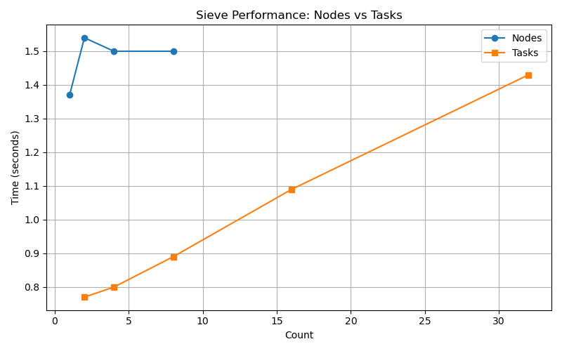

## 1.1 Can you see where the most calculation time is spent? What line number/function is it?
it's my sieve function, followed by the list comprehension I created when it returnes the final results.

## 1.2 What is the distribution of execution times in your file, is it homegeneous (uniform) or is there a power distribution? (Make a graph if it helps).
The execution time distribution is heavily skewed to this single function, with very little time spent elsewhere.
This aligns with a power distribution where most run time is concentrated in one location; it's not uniform or homogeneous.

## 2.1 At what point (cores) does it not matter anymore if you add any more (where does the plateau begin)?
After 2 it pretty much plateaus.

## 2.2 Can you explain this behavior?
It's due to spending the maximum amount of time on "talking" to other nodes and limits of distributed computing systems, the calculations won't take much time as they become smaller, but a time limit is hit, after reaching a certain number of nodes. 

## 2.3 Does this behavior change when you run it on multiple hosts rather than just multiple cpu's on one host? Why or why not?
Yes, this behavior changes when running on multiple hosts compared to multiple CPUs on a single host. As we see in the picture, using multiple hosts (Nodes) makes the process much longer even than the highest value of the tested ntask (32)! This means, networks make the process slower.

